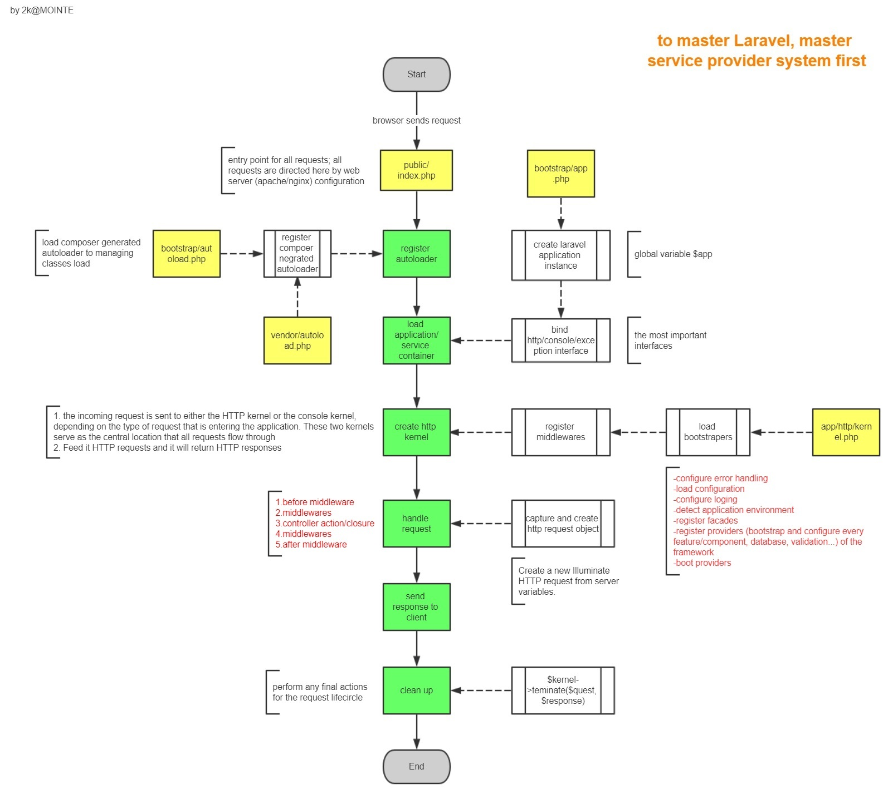

# Laravel Request Lifecycle

## 生命週期過程
### 進入點 **public/index.php**
⇩ 所有請求藉由Web伺服器引導進入public/index.php，該腳本作為所有請求的進入點， 
⇩ 也是Laravel框架載入的起點。 
⇩ 進入後，該腳本就先取得Composer的Autoloader以便管理後續的套件載入。 
⇩ 接著載入bootstrap/app.php，透過腳本取得應用、服務容器實例，然後將應用實例綁定到容器內部。 
⇩ 亦即後來的Global Variable $app。 
⇩ 下一階段，將創建內核實例，並依據請求類型分別傳入Http內核或Console內核。 
### 框架內核 **Http or Console**
⇩ 在內核中，首先定義了bootstrapper陣列，裡頭皆為請求處裡前需要執行的動作。 
⇩ 包含了錯誤處裡、日誌紀錄、設定載入、Facade註冊、Service Provider註冊、 
⇩ 應用程式環境偵測等需要被執行的任務。 
⇩ 然後，再定義請求處理前所需要的中間件，包含Http Session的存取、維護狀態判斷、CSRF驗證等等 
### 配送請求
⇩ 請求交給由路由器進行配發到負責的路由、控制器或路由相關中間件。 
⇩ 下一階段，開始進行請求處理並包含已註冊的各類中間件任務。 
### 處理請求並回應

 

## 生命週期示意圖

  Courtesy of 2k@MOINTE. 
  If any issue, please let me know. I will remove it immediately.
  
